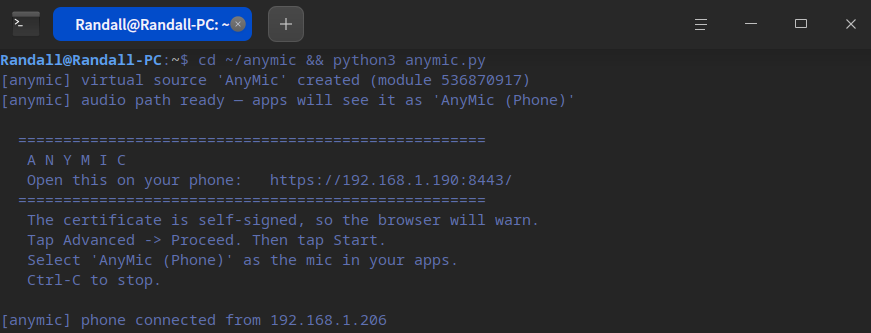
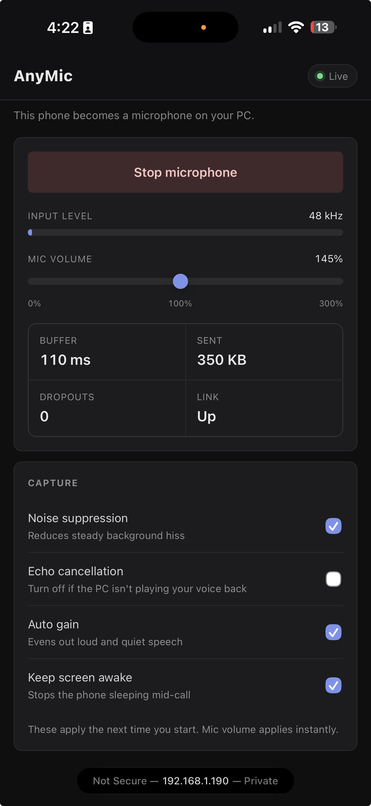

# AnyMic

Turn any phone into a microphone on Linux. No phone app, no kernel module, no root.

The phone's **browser** captures the mic and streams raw PCM over a WebSocket.
A small Python server feeds that into a **PipeWire virtual source**, which every
app — Discord, OBS, Zoom, browsers — sees as an ordinary microphone.

```
phone browser ──wss──> anymic.py ──> pw-cat ──> PipeWire virtual source ──> your apps
 getUserMedia          jitter buffer         "AnyMic (Phone)"
```

## What it looks like

Start it on the PC — it creates the virtual mic and prints the URL to open:



Open that URL on the phone, tap **Start microphone**, and it streams:



The stats are live: buffer depth, bytes sent, dropout count and link state, so
you can tell at a glance whether audio is actually flowing rather than guessing.

## Why not Wo Mic

Wo Mic needs a phone app talking a proprietary protocol to an unmaintained Linux
client, and routes audio through the `snd-aloop` kernel module. That stack has
some sharp edges this avoids:

| | Wo Mic | AnyMic |
|---|---|---|
| Phone side | App install, protocol must match client version | Any modern browser |
| Audio routing | `snd-aloop` kernel module, needs root, gone after reboot | PipeWire virtual source, user-level |
| Which loopback end? | Client writes device 0, PipeWire reads device 0 — wrong end, silent | N/A |
| Rate mismatch | No resampling; a mismatch chops audio into robot voice | Browser resamples to 48kHz |
| Network jitter | Underruns punch holes in the waveform | 120ms jitter buffer, silence-fills |
| iPhone | Not supported | Works |

## Requirements

PipeWire (`pw-cat`, `pw-link`, `pactl`), `openssl`, Python 3.8+. All standard on
a modern desktop — no pip packages.

## Use

```bash
python3 anymic.py
```

It prints a URL like `https://192.168.1.190:8443/`. Open that on the phone, tap
through the certificate warning, tap **Start microphone**.

Then pick **AnyMic (Phone)** as the input in whatever app you're using.

Ctrl-C removes the virtual source cleanly.

### Mic volume

The **Mic volume** slider on the phone page scales the input from 0% to 300%,
and takes effect immediately — no need to stop and restart. The setting is
remembered on that phone.

Gain is applied on the phone, as a `GainNode` ahead of the 16-bit conversion,
so it scales the samples while they still have full float headroom. Boosting on
the PC side instead would amplify audio that had already been quantised,
raising the noise floor along with the signal.

Watch the level meter while you set it. If the meter turns amber and **CLIP**
appears, you are driving it past full scale and the peaks are being flattened —
back off until it stops. Clipping cannot be undone further down the chain.

Leave *Auto gain* on if you just want something reasonable without fiddling;
turn it off when you want the slider to be the only thing setting the level.

### Options

```
--port 8443            listen port
--description "..."    name shown in app mic lists
--name AnyMic         PipeWire node name
--certdir ./certs      where the self-signed cert lives
```

## About that certificate warning

`getUserMedia` only works in a secure context, so plain HTTP won't do — the
browser will not offer the mic at all. The server generates a self-signed
certificate for your LAN IP on first run, which is why the phone warns once.
Tap *Advanced → Proceed*. The cert lasts 10 years and regenerates automatically
if your LAN address changes.

## Troubleshooting

**Phone says "Microphone permission denied"** — allow the mic for that site in
browser settings. Chrome remembers this per-origin, so it will stick.

**Audio stops when the screen turns off** — leave *Keep screen awake* on. Mobile
browsers suspend audio capture in the background; the page re-resumes when you
return to it, but a locked screen can still cut the stream.

**Buffer climbing, dropouts rising** — WiFi congestion. Move closer to the
router, or use the phone's hotspot. The buffer self-corrects by dropping old
audio once latency exceeds 400ms.

**Robotic or chopped audio** — should not happen; the jitter buffer fills gaps
with silence rather than stalling. If it does, check the *Dropouts* counter on
the phone: steadily climbing means packets aren't arriving in time.

**No "AnyMic (Phone)" in the app's list** — some apps cache the device list at
startup. Restart the app after starting AnyMic.

**Too quiet, or distorted** — use the Mic volume slider, and watch for the CLIP
indicator. See [Mic volume](#mic-volume).

## Run it automatically

```ini
# ~/.config/systemd/user/anymic.service
[Unit]
Description=AnyMic phone microphone
After=pipewire.service

[Service]
ExecStart=/usr/bin/python3 %h/anymic/anymic.py
Restart=on-failure

[Install]
WantedBy=default.target
```

```bash
systemctl --user enable --now anymic
```

## How the audio path works

Creating the virtual source is one `pactl` call:

```bash
pactl load-module module-null-sink media.class=Audio/Source/Virtual \
      sink_name=AnyMic channel_map=mono
```

Feeding it is the non-obvious part. WirePlumber's policy will not route a
playback stream onto a node whose `media.class` is `Audio/Source/Virtual` — it
treats it as a source and silently connects the stream to the default sink
instead, so your audio goes to the speakers and the virtual mic stays silent.
The fix is to start `pw-cat` with autoconnect off and link it by hand:

```bash
PIPEWIRE_PROPS='{ node.autoconnect=false node.name=anymic-feed }' \
  pw-cat --playback --format=s16 --rate=48000 --channels=1 --raw - &
pw-link anymic-feed:output_MONO AnyMic:input_MONO
```

The server does both, plus paces writes at exactly real time so the stream
neither starves nor accumulates latency.
